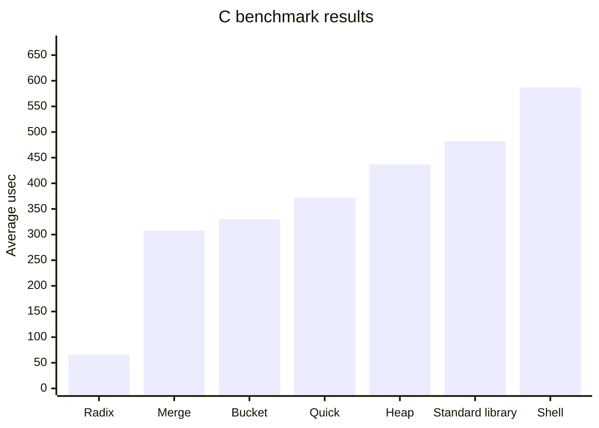
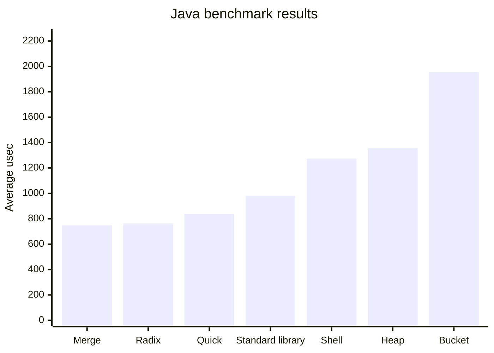
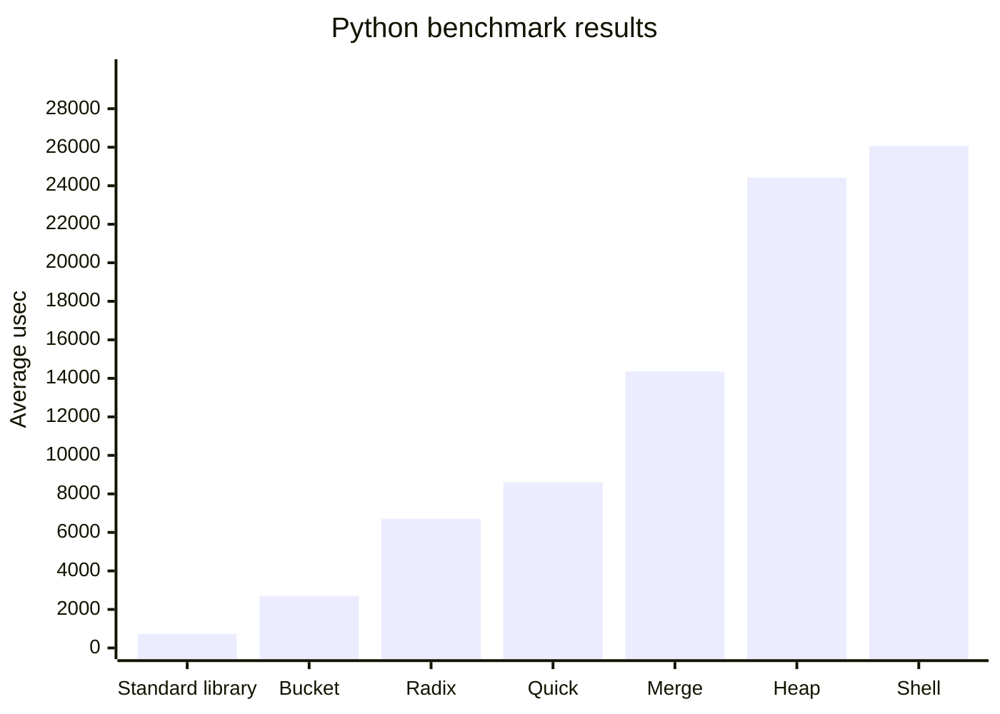

# Sorting benchmark chart report

- Mode: `fast`
- Repeats per testcase: `1`

This file is generated by `generate_benchmark_chart.py`.

### C benchmark results

| Rank | Algorithm | Avg (usec) | Complexity |
|---|---|---:|---|
| 1 | Radix sort | 66 | O(d(n+b)) |
| 2 | Merge sort | 308 | O(n log n) |
| 3 | Bucket sort | 330 | avg O(n+k) |
| 4 | Quick sort | 372 | avg O(n log n) |
| 5 | Heap sort | 437 | O(n log n) |
| 6 | Standard library sort | 482 | impl-dependent |
| 7 | Shell sort | 587 | ~O(n log n) to O(n^2) |

### Java benchmark results

| Rank | Algorithm | Avg (usec) | Complexity |
|---|---|---:|---|
| 1 | Merge sort | 748 | O(n log n) |
| 2 | Radix sort | 763 | O(d(n+b)) |
| 3 | Quick sort | 837 | avg O(n log n) |
| 4 | Standard library sort | 982 | impl-dependent |
| 5 | Shell sort | 1274 | ~O(n log n) to O(n^2) |
| 6 | Heap sort | 1355 | O(n log n) |
| 7 | Bucket sort | 1955 | avg O(n+k) |

### Python benchmark results

| Rank | Algorithm | Avg (usec) | Complexity |
|---|---|---:|---|
| 1 | Standard library sort | 727 | impl-dependent |
| 2 | Bucket sort | 2710 | avg O(n+k) |
| 3 | Radix sort | 6707 | O(d(n+b)) |
| 4 | Quick sort | 8602 | avg O(n log n) |
| 5 | Merge sort | 14353 | O(n log n) |
| 6 | Heap sort | 24417 | O(n log n) |
| 7 | Shell sort | 26070 | ~O(n log n) to O(n^2) |
